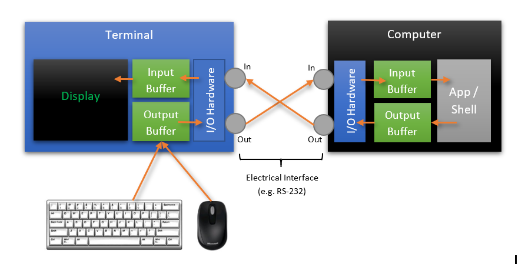
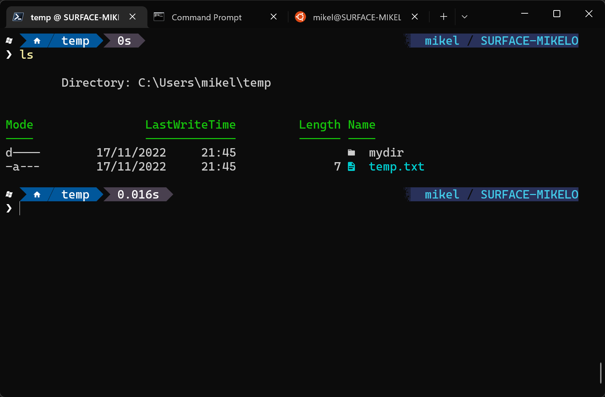
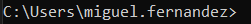
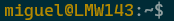
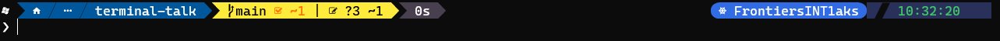

# The ultimate Windows Terminal with PowerShell

Miguel Fernández
Senior Software Engineer
Team Lego @ Frontiers


---

# Follow this presentation


https://github.com/mikeloguay/utils/blob/main/terminal-talk/README.md

---

# The basics: Terminal/Console vs Shell



---

# On Windows....



## Terminals
* Console Host
* Windows Terminal
* VS Code

## Shells
* CMD
* Windows PowerShell
* PowerShell [Core]

---

# Prompt






---

# Profile

* Script to customize the environment
  * Aliases
  * Functions
  * Customizations (prompts...)
* At user/host level
* Default location:
```powershell
echo $PROFILE
```

---

# Setup guide 1/4 (choco)

1. Open Windows Terminal as admin (Windows PowerShell by default)
2. Install choco
```powershell
Set-ExecutionPolicy Bypass -Scope Process -Force; `
    [System.Net.ServicePointManager]::SecurityProtocol `
    = [System.Net.ServicePointManager]::SecurityProtocol -bor 3072; `
    iex ((New-Object System.Net.WebClient).DownloadString('https://community.chocolatey.org/install.ps1'))
```
3. Install all the tools (with choco)
```powershell
choco install powershell-core nerd-fonts-cascadiacode oh-my-posh git vim gsudo -y
```

---

# Setup guide 2/4 (modules)

4. Close and open again Windows Terminal
5. Open a PowerShell [Core] tab (just installed)
6. Install Terminal Icons module
```powershell
gsudo Install-Module -Name Terminal-Icons -Repository PSGallery -Confirm
```
7. Update PSReadline (PowerShell module)
```powershell
gsudo install-Module PSReadLine -force
```

---

# Setup guide 3/3 (profile)

8. Create a new profile (if there is none)
```powershell
New-Item -Path $PROFILE -ItemType "file" -Force
```
9.  Enable oh-my-posh in our profile
```powershell
Add-Content $PROFILE "oh-my-posh init pwsh | Invoke-Expression"
```
10. Enable Terminal Icons in our profile
```powershell
Add-Content $PROFILE "Import-Module -Name Terminal-Icons"
```

---

# Setup guide 4/4 (terminal)

11. Set PowerShell [Core] as default on Windows Terminal
12. Set `Caskaidia MF Mono` as the default font
13. Set Windows Terminal as default terminal application
14. Open maximized by default
15. Automaticallyy copy selection to clipboard

---

# Features demo guide 1/2

- Default console
- Clone sample git repo
```powershell
git clone https://github.com/HangfireIO/Hangfire.git
```
- Change oh-my-posh theme
  - From github raw URL
  - Command to see all themes inside the Terminal:
```powershell
Get-PoshThemes
```

---

# Features demo guide 2/2

- PSReadline history with list view
```powershell
Set-PSReadLineOption -PredictionViewStyle ListView
```
- Kubernetes prompt
- WSL integration
  - Confluent CLI prompt example
---

# Some references


* [My Ultimate PowerShell prompt by Scott Hanselman](https://www.hanselman.com/blog/my-ultimate-powershell-prompt-with-oh-my-posh-and-the-windows-terminal)
* [Differences between console, terminal and shell by Scott Hanselman](https://www.hanselman.com/blog/whats-the-difference-between-a-console-a-terminal-and-a-shell)
* [Windows Command-Line series by Rich Turner](https://devblogs.microsoft.com/commandline/windows-command-line-backgrounder/)
* [Transforming PowerShell experience with PSReadLine](https://youtu.be/Q11sSltuTE0)