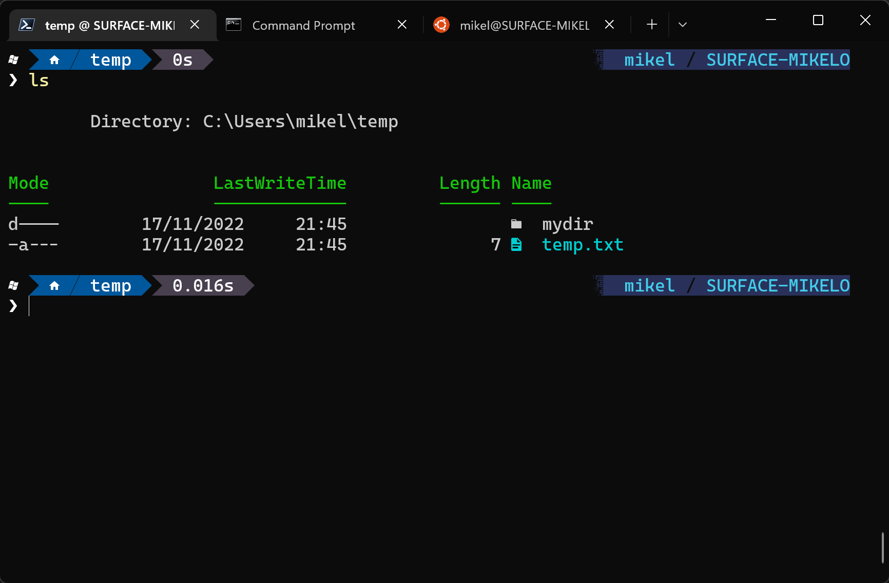

# The ultimate Windows Terminal with PowerShell

Miguel Fernández
Senior Software Engineer
Team Lego @ Frontiers


---

# The basics: Terminal/Console vs Shell


---

# On Windows....



## Terminals
* Console Host
* Windows Terminal
* VS Code

## Shells
* CMD
* Windows PowerShell
* PowerShell [Core]

<!-- demo on host machine -->

---

# Setup guide 1/3

1. Open Windows Terminal as admin
2. Run CMD -> Console Host will be open
3. Set as default terminal app
4. Run CMD -> Windows Terminal will be open
5. Install choco

```powershell
Set-ExecutionPolicy Bypass -Scope Process -Force; `
    [System.Net.ServicePointManager]::SecurityProtocol `
    = [System.Net.ServicePointManager]::SecurityProtocol -bor 3072; `
    iex ((New-Object System.Net.WebClient).DownloadString('https://community.chocolatey.org/install.ps1'))
```
---
# Setup guide 2/3

4. Install all the tools

```powershell
choco install `
    powershell-core `
    nerd-fonts-cascadiacode `
    oh-my-posh `
    terminal-icons.powershell `
    git `
    vim `
    gsudo `
    -y
```

5. Set PowerShell core as default profile
6. Enable oh-my-posh on the PowerShell profile

```powershell
New-Item -Path $PROFILE -ItemType "file" -Force
Add-Content $PROFILE "oh-my-posh init pwsh | Invoke-Expression"
```

---
# Setup guide 2/3

7. Enable terminal icons on PowerShell profile
```powershell
Add-Content $PROFILE "Import-Module -Name Terminal-Icons"
```

8. Clone sample git repo
```powershell
git clone https://github.com/HangfireIO/Hangfire.git
```

9. Update PSReadline (PowerShell module)
```powershell
gsudo install-Module PSReadLine -force
```

---

# Some references


* [My Ultimate PowerShell prompt by Scott Hanselman](https://www.hanselman.com/blog/my-ultimate-powershell-prompt-with-oh-my-posh-and-the-windows-terminal)
* [Differences between console, terminal and shell by Scott Hanselman](https://www.hanselman.com/blog/whats-the-difference-between-a-console-a-terminal-and-a-shell)
* [Windows Command-Line series by Rich Turner](https://devblogs.microsoft.com/commandline/windows-command-line-backgrounder/)
* [Transforming PowerShell experience with PSReadLine](https://youtu.be/Q11sSltuTE0)